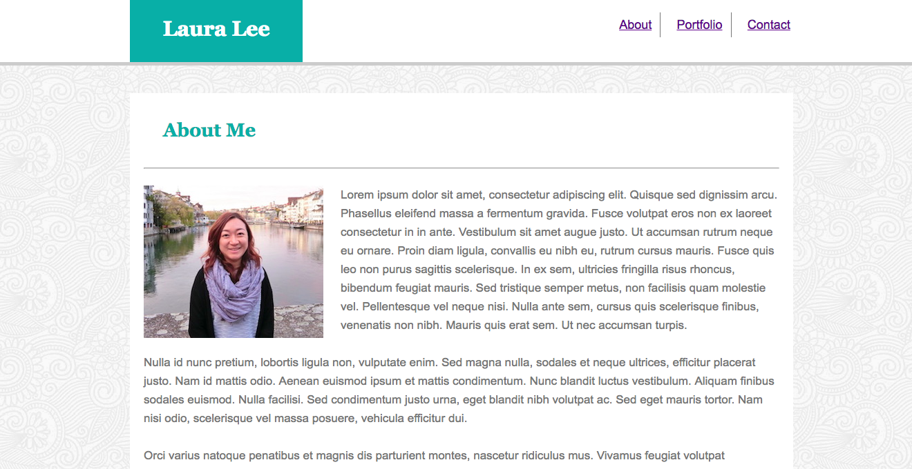

# Basic-Portfolio
Assignment_Basic-Portfolio


# Link to deployed site
https://lalatw.github.io/Basic-Portfolio/


# Images
 

# Technology used
* html
* css


# Code snippets


```
    <div class="heading">
        
        <h1>Laura Lee</h1>
        
        <ul>
            <li class="li01">
                <a href="index.html">About</a>
            </li>
    
            <li class="li01">
                <a href="portfolio.html">Portfolio</a>
            </li>
    
            <li>
                <a href="contact.html">Contact</a>
            </li>
        </ul>
        
    </div>


```


# Learning points
* Use “div” tag to group content or elements in HTML.
* Use “class” or "id" attributes to define certain elements or content along with “div” so as to better style them with CSS.
* Apply CSS Box Model concept to change layout by adjusting margin, padding, etc.
* Define font and color in CSS to present the desired design.
* Use CSS “float” and “clear” to align elements.
* Use "a" tag to link multiple pages.
* Use "form" to add input field.
* Use "textarea" tag to add multi-line text input.


# Author 
[Shuhan Laura Lee](https://lalatw.github.io/Basic-Portfolio/)


# License
Standard MIT License
